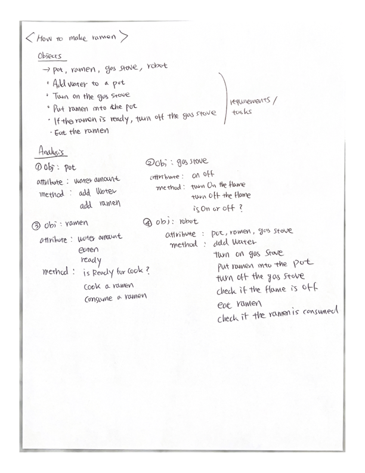
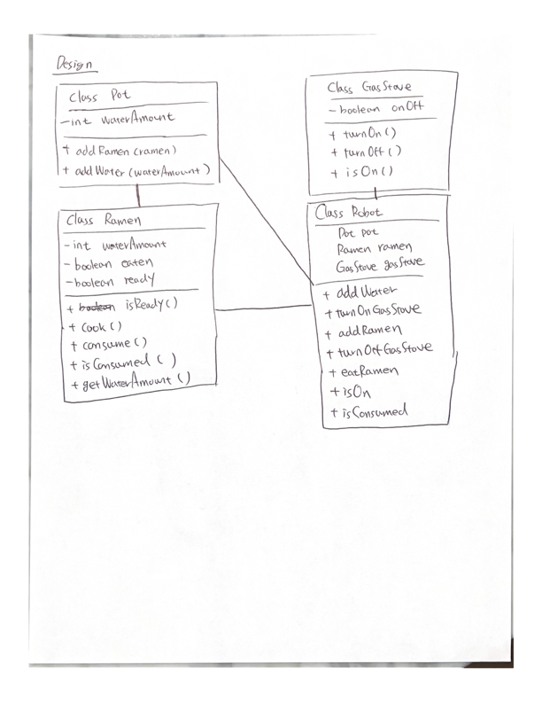
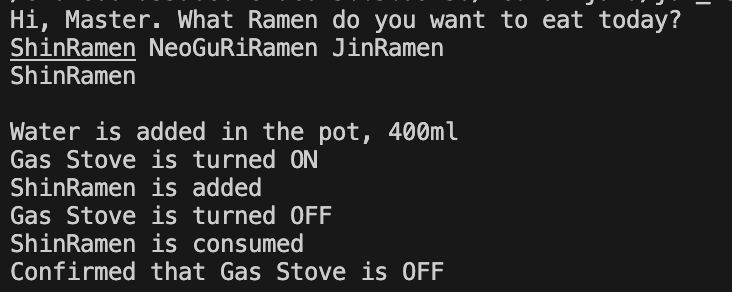

# How to Teach a Robot to Make Ramen

This is a personal project aimed at teaching myself how to implement Object-Oriented Programming (OOP) analysis and design principles in real-world scenarios, such as making ramen.

## Description

The program starts by allowing a robot to take an order (input) from a user specifying the type of ramen they wish to eat. Once the user selects a ramen, the robot initiates the cooking process. It begins by adding water, turning on the gas stove, and cooking the ramen. The process continues until the robot confirms that the gas stove has been safely turned off.

Before coding, I wrote down all the requirements on paper. I then used these requirements to create OOP analysis and design models, helping to organize the code's components. This approach was beneficial as it allowed me to write more concise code by planning out methods and attributes in advance. Although I had to revisit my initial plans to add or modify methods occasionally, for the most part, I was able to code strictly based on the requirements.

Special thanks to Mr. Lee for helping me resolve questions that arose when I encountered obstacles.

## Screenshots

### My Planning




### The Executed Result



## Technologies Used


## Setup and Usage

1. Run the Java program.
2. Choose a type of ramen from the given list.

## Bugs and Limitations

- To be determined (TBD)

## Future Features

- Implement a storage class to manage different types of ramen and their quantities.

## Project Structure

### Top-Level Directory
```
.
├── HowToMakeRamen                      # Source files
├── testDriver.class                    # Compiled file
├── testDriver.java                     # Java driver file (Run this to execute the program)
├── Images                              # Image files
└── README.md
```

### Source Files
```
.
├── ...
├── HowToMakeRamen
│   ├── GasStove.java                    # Source file
│   ├── JinRamen.java                    # Source file 
│   ├── NeoGuRiRamen.java                # Source file
│   ├── Order.java                       # Source file
│   ├── Pot.java                         # Source file
│   ├── Ramen.java                       # Source file
│   ├── Robot.java                       # Source file
│   └── ShinRamen.java                   # Source file
└── ...
```
